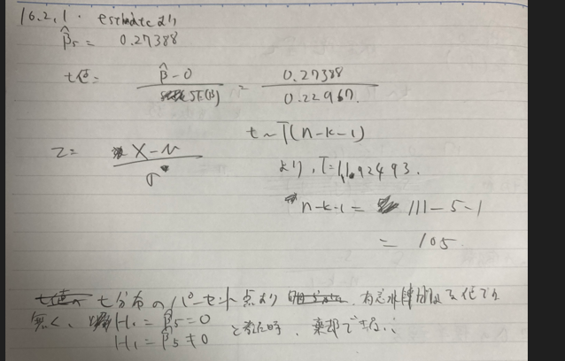

# 重回帰分析

- 全般
  - 書いた人のせいか、線形代数が頻出

- 演習
  - 16.1.1
    - 重回帰したときの、各回帰変数のp値がわかっていない。
      - p129 重回帰分析の検定に書いてある。
      - 参考　統計学の時間　https://bellcurve.jp/statistics/course/9702.html
      - ひとまず、導出とかはワークブックにないから統計学の時間の解法をまず暗記する
    - 重回帰した時の、標準誤差の値がなんなのかわかっていない。
      - 標準誤差→推定量のばらつき。
      - とりあえず上の説明　https://contents-open.hatenablog.com/entry/2021/07/11/163530
      - 標準誤差の定義。というか、R言語全般の説明になってる。同志社の広義のやつ。マジ参考　https://mjin.doshisha.ac.jp/R/Chap_14/14.html
      - 標準誤差をもとに、検定統計量が作成されるが、この標準誤差は切片と、各辺回帰係数で導出方法が違った。理由とかはまだ理解できてないというか、ネットにない。とりあえず上のサイトの形で覚える
    - 自由度調整済み決定係数
      - 上の同志社のやつにも書いてある。
      - 決定係数は変数を増やすほど増大するため利用される
    - 自由度調整済み決定係数が分かれば解ける
  - 16.1.2
    - p値が優位水準α⁼０．０５より小さいものを選べばよい
  - 16.2.1
    -   
  - 16.2.2
    - 決定係数、F値、AICの意味を理解して、予測誤差の観点から最も適する指標を上から選び出して利用する。
      - 決定係数：総変動に対する回帰変動の割合。平均値からの実測値の差分に対して、回帰によってどれだけ予測できているかを表す指標
        - 概要　https://bellcurve.jp/statistics/course/9706.html
        - 決定係数の意味　https://biolab.sakura.ne.jp/index.html
      - F値：回帰分析全体を通して意味があるのかを検定するために使う値。具体的に帰無仮説として、β１-βｎ=0,対立仮説としてβ１からβｎのいずれかがノットイコール０として検定を行う際の検定統計量がf値になる。
      - AIC 尤度に対してパラメータ数でペナルティを与えることによって、モデルの適合具合と、説明変数量をバランスよく持ってるかを表した値。この値が低いほど良いモデルで、複数のモデルに対してこの値の大小を比較してモデルがよいか判断する
        - 概要　https://best-biostatistics.com/correlation_regression/aic.html
    - 解説がよくわからなかった。AICでは予測誤差、決定係数では当てはまりの良さとしていたが、双方ともテストデータに対して適用したものでもなく、違いがわからなかった。
  - 16.3.1,2,3
    - l1,l2,elasticnetの概要を抑えてればとける
  - 
