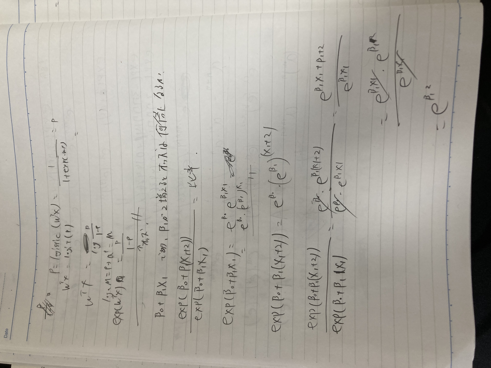
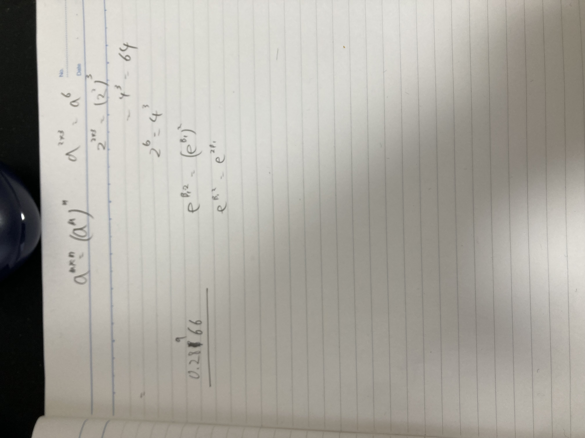

# 質的回帰

- 問18-1
  - 1
    - Q
      - ようかい確率が0.5になるときの係数LIの値は？
      - LIが30の時のようかい確率は？
    - A
      - logistic回帰の式が分かればそれに代入するだけ。
  - 2
    - Q: LIが２増えたときオッズが何倍になるか
    - A: 
    - 
- 18-2
  - 1
    - A:
  - 2
    - リスクとは？
      - オッズ(p/1-pであり、つまり成功確率に対する失敗確率の比)の比である。比較対象のオッズ/もとになるオッズから求められる。 基本的にロジスティック回帰は医療の診断(例:目的変数yをがんであるか否か)に使われることが多い。なのでオッズががんの発症確率の比率などを表しており、説明変数の値の差分などによってその発症率がどの程度変化（悪化）するかを判断するためにリスク（オッズの比）という表現をすると考えられる。
    - A: